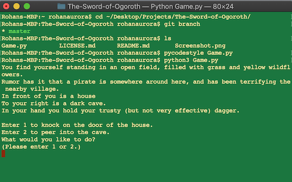

# The Sword of Ogoroth

A text-based adventure game using Python.

### Start Game
To start the game be sure to install [Python 3 (version 3.x)](https://www.python.org/downloads/), run:
```bash
$ python3 Game.py
```

#### Demo - 



#### Contributing

This might be great practice if you want to learn Python. If you encounter any problem or have any suggestions, please [open an issue](https://github.com/rohanaurora/The-Sword-of-Ogoroth/issues) or [send a PR](https://github.com/rohanaurora/The-Sword-of-Ogoroth/pulls).
